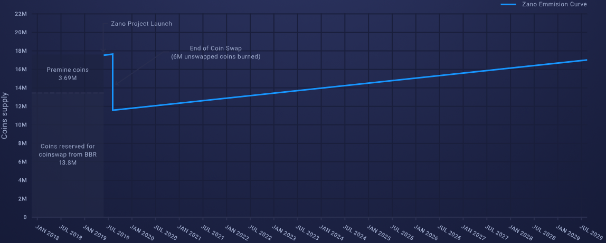
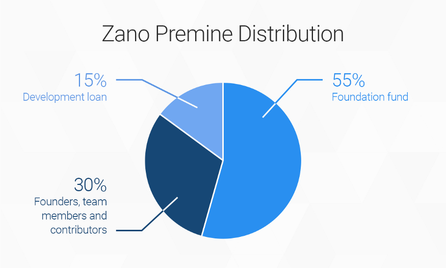

# Emission

### Where does the emission come from?

Zano has a hybrid PoW/PoS consensus algorithm to secure the network and therefore emission is generated from two distinct sources:

Proof of Work (PoW) mining. PoW mining creates new ZANO coins to reward miners for completing the calculation and therefore contributing to the network. 100% of the block reward goes to miners.

Proof of Stake (PoS) staking. PoS staking also creates new ZANO coins to reward stakers for staking their funds and therefore contributing to the network.. 100% of the block reward goes to stakers.

### Emission specifications

| Emission              |
| --------------------- | ------------ |
| Block Time            | 1 minute     |
| Block Reward          | 1 ZANO       |
| Maximum Supply        | ∞ (uncapped) |
| Fee on TXs (flat fee) | 0.01 ZANO    |

### Emission motivation

Zano made the decision to set the block reward relatively low to avoid unnecessary selling price pressure while keeping the chain safe from TX flood. The block reward is fixed at 1 ZANO per block. We have an uncapped max supply because the assumption that TX flow and its fees would be enough to cover miners' appetite might not be accurate and Bitcoin might become a sad example of this. Having a fixed and slow emission (backed by strong consensus algo) looks like a more safe choice to us.

Zano total supply increases slightly over time while the inflation percentage decreases sligthly over time which can be seen below.

| Date       | Total Supply (ZANO) | Increasement of total supply compared to the year before |
| ---------- | ------------------- | -------------------------------------------------------- |
| 01-01-2023 | 13,530,567          | ~4,04%                                                   |
| 01-01-2024 | 14,056,167          | ~3,88%                                                   |
| 01-01-2025 | 14,581,767          | ~3,74%                                                   |
| 01-01-2026 | 15,107,367          | ~3,60%                                                   |
| 01-01-2027 | 15,632,967          | ~3,48%                                                   |
| 01-01-2028 | 16,158,567          | ~3,36%                                                   |
| 01-01-2029 | 16,684,167          | ~3,25%                                                   |
| 01-01-2030 | 17,209,767          | ~3,15%                                                   |
| 01-01-2031 | 17,735,367          | ~3,05%                                                   |
| 01-01-2032 | 18,260,967          | ~2,96%                                                   |
| 01-01-2033 | 18,786,567          | ~2,88%                                                   |

The chart below visually displays the emission (shown in blue) of the number of coins (on the vertical access) and the time duration (in 6 month timestamps) of the total supply.

### Why was there a coinswap with Boolberry?

The Zano project is a technological evolution of the Boolberry (BBR) project, a previous project of the Zano team. However, at the same time, the project has different emission curve and premine. To not screw over holders of Boolberry (BBR) we decided that it would be fair to give ₡BBR holders a choice: they were able to join in on the new model by participating in the coinswap and exchanging their BBR to ZANO, or they were welcome to keep their stake in BBR (which will continue to be supported).

The coinSwap resulted in 7.8M swapped coins. The remaining ~6M of the initial supply were burned the day after the end of coinswap (proof link): https://explorer.zano.org/transaction/4d4ff1cf20fd18cc72eb88e36da5430498d343bcd21122de5b0ba2d324944722

More information on the concluded coinswap can be found here: https://blog.zano.org/the-coinswap-has-concluded/

### Why is the block reward just 1 ZANO?

Zano has a unique consensus system in which in order to perform the classic 51% attack, you need to have at least 51% PoW hashrate AND 51% PoS power (there can also be other ratios like 20%/90% and so on (see the [whitepaper](https://zano.org/downloads/zano_wp.pdf)). This way an attack becomes very expensive, in particular because the purchase of a significant portion of the coins on the market, would dramatically increase the price. If you try to use a small percentage of PoS coins for the attack, then the PoW power necessary for the attack becomes 800% or more. This makes it possible to establish a relatively low block reward and at the same time provide a high security level for the transaction history.

### Premine

Being actively involved into crypto space since 2014, the Zano team has been studying every financial model in the crypto market. Some of them are more sustainable than others but in the end they all come down to burning through reserves if the project doesn’t get picked up before reaching the “mainstream” phase.

Even top tier projects have come across this issue in the past. These financial struggles have either required another round of personal investment, a second ICO, a call for donations, or simply resulted in the end of those projects.

Zano proposes a new solution. By staking our own development fund we will be able to run our operations using the interest gained, giving the team an ongoing source of funding to keep everyone paid and working happily. This also means that the actual development fund will remain intact.

**55% Foundation fund (2029500 ZANO)** Set aside for marketing, partnerships, and ongoing project expenses. This will be transparent and reported.

**30% Founders, team members, and contributors (1107000 ZANO)**
Coins are reserved for incentivizing current and future team members and contributors.

**15% Development loan (553500 ZANO)**
Repayment of the coins loaned by a group of Boolberry shareholders in early 2018 to fund the project development leading up to the coinswap.

The Zano Foundation will issue regular reports on project expenses. The dev fund amount can be tracked live via our [explorer](https://explorer.zano.org/).

**Conclusion**

Most important to us is the long-term security and stability of Zano. This ability to generate income to fund the project continuously is a new and exciting possibility. We’ve spent a great deal of time pouring over the numbers and believe this path forward not only assures success for the team, but also for all holders of Zano coins for years to com
